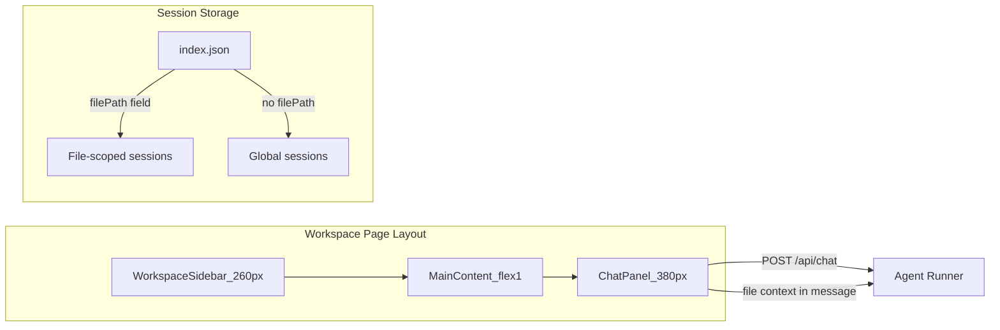

# File Chat Sidebar for Workspace

## Architecture

The workspace page layout changes from `[sidebar | content]` to `[sidebar | content | chat-panel]`. The chat panel reuses the same `useChat` + `ChatMessage` + session persistence logic from the main chat page.



## Step 1: Extract `ChatPanel` from `page.tsx`

Extract the entire chat UI (messages list, input form, session management, `useChat`, streaming status) from [apps/web/app/page.tsx](apps/web/app/page.tsx) into a new reusable component:

**New file:** `apps/web/app/components/chat-panel.tsx`

```typescript
type ChatPanelProps = {
  /** When set, scopes sessions to this file and prepends content as context */
  fileContext?: { path: string; content: string; filename: string };
  /** External session list (for sidebar session list) */
  sessions?: WebSessionMeta[];
  onSessionsChange?: () => void;
  /** Compact mode for workspace sidebar (no lobster, smaller empty state) */
  compact?: boolean;
};
```

- Internally uses `useChat` from `@ai-sdk/react` with `DefaultChatTransport`
- Manages its own `currentSessionId`, `savedMessageIdsRef`, `input`, etc. (same logic as `page.tsx`)
- When `fileContext` is provided:
  - The first message in each session is prefixed with: `"[Context: file '{path}']\n\n{content}\n\n---\n\nUser question: {userText}"` -- subsequent messages just send `userText` as-is (the agent already has context from the conversation)
  - Session creation passes `filePath` to the API
- Renders: header bar (with session title / status), scrollable message list using `ChatMessage`, error bar, input form

Then **simplify `page.tsx**` to just:

```tsx
<Sidebar ... />
<ChatPanel />
```

## Step 2: Tag file sessions in web-sessions API

Modify [apps/web/app/api/web-sessions/route.ts](apps/web/app/api/web-sessions/route.ts):

- Add optional `filePath` to `WebSessionMeta` type
- `POST` accepts `filePath` in the body and stores it in the index
- `GET` accepts `?filePath=...` query param:
  - If `filePath` is set: returns only sessions where `meta.filePath === filePath`
  - If `filePath` is absent: returns only sessions where `meta.filePath` is falsy (excludes file-scoped sessions from the main list)

This single change means the main chat sidebar automatically stops showing file sessions, with no other code changes needed.

## Step 3: Add chat sidebar to workspace page

Modify [apps/web/app/workspace/page.tsx](apps/web/app/workspace/page.tsx):

- Add a collapsible right panel (380px) that renders `ChatPanel` with `fileContext`
- The panel appears when a file or document is selected (content kinds: `"document"`, `"file"`)
- Add a toggle button in the breadcrumbs bar to show/hide the chat panel
- Pass the file's `content`, `path`, and `filename` as `fileContext`
- The panel shows a mini session list at top (file-scoped sessions only) and the chat below

Layout becomes:

```
+------------------+------------------------+-------------------+
| WorkspaceSidebar | Content (flex-1)       | ChatPanel (380px) |
| (260px)          |                        | [toggle]          |
+------------------+------------------------+-------------------+
```

## Step 4: File-scoped session list inside ChatPanel

Inside `ChatPanel`, when `fileContext` is provided:

- Fetch sessions filtered by `filePath` via `GET /api/web-sessions?filePath=...`
- Show a compact session list (just titles, clickable) above the messages area
- "New chat" button creates a new file-scoped session
- Selecting a session loads its messages (same logic as main page's `handleSessionSelect`)

## Step 5: Live file reload after agent edits

When the agent finishes streaming (status goes from `streaming` -> `ready`) and `fileContext` is provided:

- Re-fetch the file content via `GET /api/workspace/file?path=...`
- Call a callback `onFileChanged?.(newContent)` so the workspace page can update `ContentState` without a full reload
- This makes edits appear live in the file viewer/document view next to the chat

## Key files touched

| File                                     | Change                               |
| ---------------------------------------- | ------------------------------------ |
| `apps/web/app/components/chat-panel.tsx` | **New** -- extracted chat UI + logic |
| `apps/web/app/page.tsx`                  | Simplify to use `ChatPanel`          |
| `apps/web/app/api/web-sessions/route.ts` | Add `filePath` field + filtering     |
| `apps/web/app/workspace/page.tsx`        | Add right chat sidebar with toggle   |

## What stays the same (reused as-is)

- `ChatMessage` component -- no changes
- `ChainOfThought` component -- no changes
- `/api/chat` route + `agent-runner.ts` -- no changes (file context goes in the message text)
- `/api/web-sessions/[id]` and `/api/web-sessions/[id]/messages` routes -- no changes
- `useChat` from `@ai-sdk/react` -- same transport, same everything
