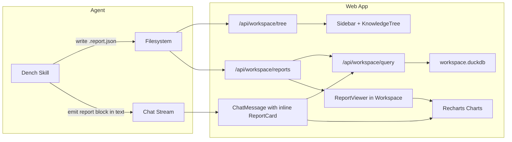

# Reports / Analytics Layer for Dench Workspace

## Architecture

Reports are **JSON config files** (`.report.json`) that declare SQL queries to run against `workspace.duckdb` and how to visualize the results. The web app executes SQL at render time (live data), renders charts via Recharts, and supports interactive filters.

Reports surface in **three places**:

1. **Workspace view** -- full-page report dashboard when clicking a report in the tree
2. **Chat** -- inline chart artifact when the agent generates a report in conversation
3. **Sidebar** -- reports listed under a new "Reports" section



---

## Report Definition Format

Stored as `.report.json` files in `dench/reports/` (or nested under any knowledge path). Agent generates these via the `write` tool.

```json
{
  "version": 1,
  "title": "Deals Pipeline",
  "description": "Revenue breakdown by stage and rep",
  "panels": [
    {
      "id": "deals-by-stage",
      "title": "Deal Count by Stage",
      "type": "bar",
      "sql": "SELECT \"Stage\", COUNT(*) as count FROM v_deal GROUP BY \"Stage\" ORDER BY count DESC",
      "mapping": { "xAxis": "Stage", "yAxis": ["count"] },
      "size": "half"
    },
    {
      "id": "revenue-trend",
      "title": "Revenue Over Time",
      "type": "area",
      "sql": "SELECT DATE_TRUNC('month', created_at) as month, SUM(\"Amount\"::NUMERIC) as revenue FROM v_deal GROUP BY month ORDER BY month",
      "mapping": { "xAxis": "month", "yAxis": ["revenue"] },
      "size": "half"
    },
    {
      "id": "stage-distribution",
      "title": "Stage Distribution",
      "type": "pie",
      "sql": "SELECT \"Stage\", COUNT(*) as count FROM v_deal GROUP BY \"Stage\"",
      "mapping": { "nameKey": "Stage", "valueKey": "count" },
      "size": "third"
    }
  ],
  "filters": [
    {
      "id": "date-range",
      "type": "dateRange",
      "label": "Date Range",
      "column": "created_at"
    },
    {
      "id": "assigned-to",
      "type": "select",
      "label": "Assigned To",
      "sql": "SELECT DISTINCT \"Assigned To\" as value FROM v_deal WHERE \"Assigned To\" IS NOT NULL",
      "column": "Assigned To"
    }
  ]
}
```

**Chart types supported:** `bar`, `line`, `area`, `pie`, `donut`, `radar`, `radialBar`, `scatter`, `funnel`.
**Panel sizes:** `full`, `half`, `third` (CSS grid layout).
**Filter types:** `dateRange`, `select`, `multiSelect`, `number`.

When filters are active, they inject `WHERE` clauses into each panel's SQL before execution.

---

## Phase 1: Recharts + Report Viewer Component

**Add Recharts dependency:**

- [apps/web/package.json](apps/web/package.json) -- add `recharts` to dependencies

**New components** (all in `apps/web/app/components/charts/`):

- `**chart-panel.tsx**` -- Wrapper that takes a panel config + data rows, renders the correct Recharts chart (Bar, Line, Area, Pie, etc.). Uses the app's CSS variable palette for theming (`--color-accent`, `--color-text`, `--color-border`). One component, switch on `panel.type`.
- `**filter-bar.tsx**` -- Horizontal filter strip. Reads filter configs from the report, fetches options for `select` type filters via SQL, renders date pickers / dropdowns. Emits active filter state upward.
- `**report-viewer.tsx**` -- Full report dashboard. Fetches report config (from file or prop), iterates panels, executes each panel's SQL (with filter injection), renders `ChartPanel` components in a CSS grid (`size` controls column span). Includes a header with title/description and the filter bar.

---

## Phase 2: Workspace Integration

**Extend content types** in [apps/web/app/workspace/page.tsx](apps/web/app/workspace/page.tsx):

- Add `report` to the `ContentState` union: `{ kind: "report"; reportPath: string; filename: string }`
- Add `report` case to `ContentRenderer` that renders `ReportViewer`
- In `loadContent`, detect `.report.json` files and load as `report` kind

**Extend knowledge tree** in [apps/web/app/components/workspace/knowledge-tree.tsx](apps/web/app/components/workspace/knowledge-tree.tsx):

- Add `"report"` to the `TreeNode.type` union
- Add report icon (bar chart icon) to `NodeTypeIcon`

**Extend tree API** in [apps/web/app/api/workspace/tree/route.ts](apps/web/app/api/workspace/tree/route.ts):

- Detect `.report.json` files and assign them `type: "report"` in the tree

**New API route** -- `apps/web/app/api/workspace/reports/execute/route.ts`:

- POST `{ sql: string, filters?: FilterState }` -- injects filter WHERE clauses into SQL, executes via `duckdbQuery`, returns rows
- This is separate from the generic query endpoint because it handles filter injection safely

---

## Phase 3: Chat Artifact (Inline Reports)

**Report block convention in agent text:**
The agent emits a fenced code block with language `report-json` containing the report JSON. Example in the streamed text:

````
Here's your pipeline analysis:

```report-json
{"version":1,"title":"Deals by Stage","panels":[...]}
````

The data shows most deals are in the Discovery stage.

`````

**Modify [apps/web/app/components/chat-message.tsx](apps/web/app/components/chat-message.tsx):**

- In `groupParts`, detect text segments containing ````report-json ... ```` blocks
- Split text around report blocks into `text` and `report-artifact` segments
- New segment type: `{ type: "report-artifact"; config: ReportConfig }`

**New component** -- `apps/web/app/components/charts/report-card.tsx`:

- Compact inline report card rendered inside chat bubbles
- Shows report title + a subset of panels (auto-sized to fit chat width)
- "Open in Workspace" button that saves to filesystem + navigates
- "Pin" action to persist an ephemeral chat report as a `.report.json` file

---

## Phase 4: Sidebar Reports Section

**Modify [apps/web/app/components/sidebar.tsx](apps/web/app/components/sidebar.tsx):**

- Add "Reports" as a new `SidebarSection` (between Workspace and Memories)
- Fetch report list from `/api/workspace/tree` (filter for `type: "report"` nodes)
- Each report links to `/workspace?path=reports/{name}.report.json`
- Show chart icon + report title

---

## Phase 5: Dench Skill Updates

**Modify [skills/dench/SKILL.md](skills/dench/SKILL.md):**

- Add Section 13: Report Generation
- Document the `.report.json` format with full schema reference
- Provide example reports for common CRM analytics:
  - Pipeline funnel (deals by stage)
  - Revenue trend over time
  - Lead source breakdown
  - Activity/task completion rates
  - Contact growth over time
- Instruct the agent to:
  - Create reports in `reports/` directory
  - Use the existing `v_{object}` PIVOT views in SQL queries
  - Include relevant filters (date range, assignee, status)
  - Emit `report-json` blocks in chat for inline rendering
  - Choose appropriate chart types for the data shape
- Add a "Post-Report Checklist" matching the existing post-mutation pattern

---

## File Summary


| Action | File                                                                 |
| ------ | -------------------------------------------------------------------- |
| Modify | `apps/web/package.json` (add recharts)                               |
| Create | `apps/web/app/components/charts/chart-panel.tsx`                     |
| Create | `apps/web/app/components/charts/report-viewer.tsx`                   |
| Create | `apps/web/app/components/charts/report-card.tsx`                     |
| Create | `apps/web/app/components/charts/filter-bar.tsx`                      |
| Create | `apps/web/app/api/workspace/reports/execute/route.ts`                |
| Modify | `apps/web/app/workspace/page.tsx` (add report content type)          |
| Modify | `apps/web/app/components/chat-message.tsx` (detect report blocks)    |
| Modify | `apps/web/app/components/sidebar.tsx` (Reports section)              |
| Modify | `apps/web/app/components/workspace/knowledge-tree.tsx` (report node) |
| Modify | `apps/web/app/api/workspace/tree/route.ts` (detect .report.json)     |
| Modify | `skills/dench/SKILL.md` (report generation instructions)             |
`````
