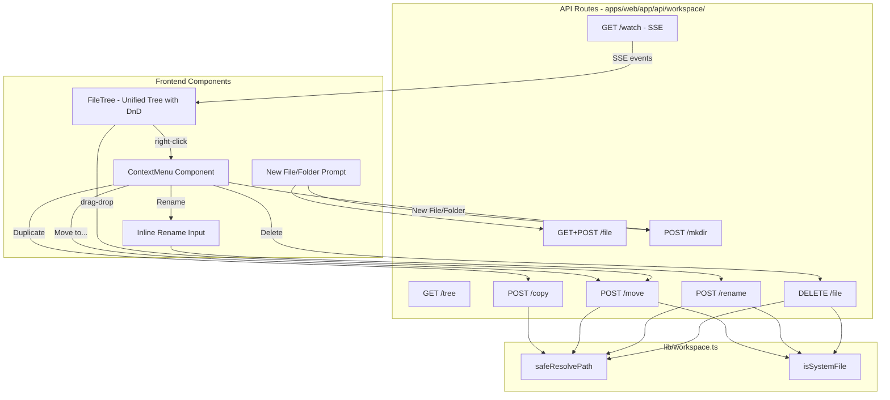

# Full File System Manager Sidebar

## Current State

Two sidebar trees render workspace files read-only:

- **Home sidebar** (`[apps/web/app/components/sidebar.tsx](apps/web/app/components/sidebar.tsx)`): `WorkspaceSection` / `WorkspaceTreeNode` -- compact tree inside collapsible section
- **Workspace sidebar** (`[apps/web/app/components/workspace/workspace-sidebar.tsx](apps/web/app/components/workspace/workspace-sidebar.tsx)`): wraps `KnowledgeTree` from `[knowledge-tree.tsx](apps/web/app/components/workspace/knowledge-tree.tsx)`

Both fetch from `GET /api/workspace/tree` (`[apps/web/app/api/workspace/tree/route.ts](apps/web/app/api/workspace/tree/route.ts)`). File read/write exists at `/api/workspace/file` (`[apps/web/app/api/workspace/file/route.ts](apps/web/app/api/workspace/file/route.ts)`). No delete, rename, move, mkdir, or copy endpoints exist. No context menus, drag-and-drop, or live refresh.

## Architecture



## 1. New Backend API Endpoints

Add to `[apps/web/app/api/workspace/](apps/web/app/api/workspace/)`:

`**DELETE /api/workspace/file**` - Delete a file or folder

- Body: `{ path: string }`
- Reject if `isSystemFile(path)` returns true
- Use `fs.rmSync(absPath, { recursive: true })` for folders

`**POST /api/workspace/rename**` - Rename a file or folder (new route file)

- Body: `{ path: string, newName: string }`
- Reject system files; validate newName (no slashes, no `.` prefix for non-system)
- Use `fs.renameSync(oldAbs, newAbs)` where newAbs replaces only the basename

`**POST /api/workspace/move**` - Move a file/folder to a new parent (new route file)

- Body: `{ sourcePath: string, destinationDir: string }`
- Reject system files; validate destination exists and is a directory
- Use `fs.renameSync(srcAbs, join(destAbs, basename(srcAbs)))`

`**POST /api/workspace/mkdir**` - Create a directory (new route file)

- Body: `{ path: string }`
- Use `fs.mkdirSync(absPath, { recursive: true })`

`**POST /api/workspace/copy**` - Duplicate a file or folder (new route file)

- Body: `{ path: string, destinationPath?: string }`
- If no destination, auto-name as `<name> copy.<ext>`
- Use `fs.cpSync` for recursive copy

`**GET /api/workspace/watch**` - SSE endpoint for live changes (new route file)

- Uses `chokidar` to watch the dench workspace root
- Streams SSE events: `{ type: "add"|"change"|"unlink"|"addDir"|"unlinkDir", path: string }`
- Client reconnects on close; debounce events (200ms)

### System File Protection

Add to `[apps/web/lib/workspace.ts](apps/web/lib/workspace.ts)`:

```typescript
const SYSTEM_FILE_PATTERNS = [
  /^\.object\.yaml$/,
  /^workspace\.duckdb/,
  /^workspace_context\.yaml$/,
  /\.wal$/,
  /\.tmp$/,
];

export function isSystemFile(relativePath: string): boolean {
  const basename = relativePath.split("/").pop() ?? "";
  return SYSTEM_FILE_PATTERNS.some((p) => p.test(basename));
}
```

Extend `safeResolvePath` to optionally accept a `mustExist: false` flag (currently returns null for non-existent paths, but mkdir/create need paths that don't exist yet).

## 2. Context Menu Component

Create `[apps/web/app/components/workspace/context-menu.tsx](apps/web/app/components/workspace/context-menu.tsx)`:

- Pure CSS + React portal-based context menu (no library, matches the zero-dep approach)
- Positioned at cursor coordinates, clamped to viewport
- Closes on click-outside, Escape, or scroll
- Menu items with icons, keyboard shortcut hints, separators, and disabled states

**Menu structure** (mirrors Finder):

| For files  | For folders          | For empty area |
| ---------- | -------------------- | -------------- |
| Open       | Open                 | New File       |
| Rename     | New File inside...   | New Folder     |
| Duplicate  | New Folder inside... | Paste          |
| Copy       | Rename               | ---            |
| Move to... | Duplicate            | ---            |
| ---        | Copy                 | ---            |
| Get Info   | Move to...           | ---            |
| ---        | ---                  | ---            |
| Delete     | Delete               | ---            |

System files (`.object.yaml`, `workspace.duckdb`) show the same menu but all mutating actions are **disabled** with a lock icon and "System file" tooltip.

## 3. Drag-and-Drop for File Moves

Install `@dnd-kit/core` + `@dnd-kit/sortable` + `@dnd-kit/utilities` (lightweight, ~15KB gzipped, React 19 compatible).

Create `[apps/web/app/components/workspace/dnd-file-tree.tsx](apps/web/app/components/workspace/dnd-file-tree.tsx)`:

- Each tree node is both a **draggable** and a **droppable** (folders accept drops)
- Drag overlay shows a ghost of the file/folder name with icon
- Drop targets highlight with accent border when hovered
- On drop: call `POST /api/workspace/move` with `{ sourcePath, destinationDir }`
- System files: draggable is **disabled** (visual lock indicator)
- Folder auto-expand on hover during drag (300ms delay)
- Drop validation: prevent dropping a folder into itself or its children

## 4. Inline Rename

- Double-click or press Enter/F2 on a selected node to enter rename mode
- Replace the label `<span>` with a controlled `<input>` pre-filled with the current name
- Commit on Enter or blur; cancel on Escape
- Call `POST /api/workspace/rename` on commit
- Shake animation + red border on validation error (empty name, invalid chars, name collision)

## 5. Unified FileManagerTree Component

Refactor `[knowledge-tree.tsx](apps/web/app/components/workspace/knowledge-tree.tsx)` into a new `FileManagerTree` that wraps DnD + context menu + inline rename:

```
FileManagerTree (DndContext provider + SSE watcher)
  └─ FileManagerNode (draggable + droppable + onContextMenu + double-click rename)
       ├─ ChevronIcon
       ├─ NodeIcon (+ lock badge for system files)
       ├─ InlineRenameInput | Label
       └─ Children (recursive)
```

Both sidebars (`sidebar.tsx` WorkspaceSection and `workspace-sidebar.tsx`) will use this unified component, passing a `compact` prop to control spacing/features for the home sidebar (e.g., hide "Get Info", simpler context menu).

## 6. Live Reactivity (SSE)

Create a `useWorkspaceWatcher` hook in `[apps/web/app/hooks/use-workspace-watcher.ts](apps/web/app/hooks/use-workspace-watcher.ts)`:

- Opens an `EventSource` to `GET /api/workspace/watch`
- On any file event, debounces and refetches the tree from `/api/workspace/tree`
- Provides `tree`, `loading`, and `refresh()` to consumers
- Auto-reconnects with exponential backoff (1s, 2s, 4s, max 30s)
- Falls back to polling every 5s if SSE fails

Both sidebars and the workspace page will use this hook for shared, reactive tree state.

## 7. Keyboard Shortcuts

In the `FileManagerTree`, attach keyboard handlers on the focused tree container:

- **Delete / Backspace**: Delete selected item (with confirmation dialog)
- **Enter / F2**: Start inline rename
- **Cmd+C**: Copy path to clipboard
- **Cmd+D**: Duplicate
- **Cmd+N**: New file in current folder
- **Cmd+Shift+N**: New folder in current folder
- **Arrow keys**: Navigate tree up/down, expand/collapse with left/right
- **Space**: Quick Look / preview toggle (future)

## Files Changed

| File                                                      | Action                                                         |
| --------------------------------------------------------- | -------------------------------------------------------------- |
| `apps/web/package.json`                                   | Add `@dnd-kit/core`, `@dnd-kit/sortable`, `@dnd-kit/utilities` |
| `apps/web/lib/workspace.ts`                               | Add `isSystemFile()`, extend `safeResolvePath`                 |
| `apps/web/app/api/workspace/file/route.ts`                | Add `DELETE` handler                                           |
| `apps/web/app/api/workspace/rename/route.ts`              | New -- rename endpoint                                         |
| `apps/web/app/api/workspace/move/route.ts`                | New -- move endpoint                                           |
| `apps/web/app/api/workspace/mkdir/route.ts`               | New -- mkdir endpoint                                          |
| `apps/web/app/api/workspace/copy/route.ts`                | New -- copy endpoint                                           |
| `apps/web/app/api/workspace/watch/route.ts`               | New -- SSE file watcher                                        |
| `apps/web/app/components/workspace/context-menu.tsx`      | New -- right-click menu                                        |
| `apps/web/app/components/workspace/file-manager-tree.tsx` | New -- unified DnD + context menu tree                         |
| `apps/web/app/components/workspace/inline-rename.tsx`     | New -- inline rename input                                     |
| `apps/web/app/hooks/use-workspace-watcher.ts`             | New -- SSE watcher hook                                        |
| `apps/web/app/components/workspace/knowledge-tree.tsx`    | Refactor into file-manager-tree                                |
| `apps/web/app/components/workspace/workspace-sidebar.tsx` | Use new FileManagerTree                                        |
| `apps/web/app/components/sidebar.tsx`                     | Use new FileManagerTree (compact mode)                         |
| `apps/web/app/workspace/page.tsx`                         | Use `useWorkspaceWatcher` hook                                 |
